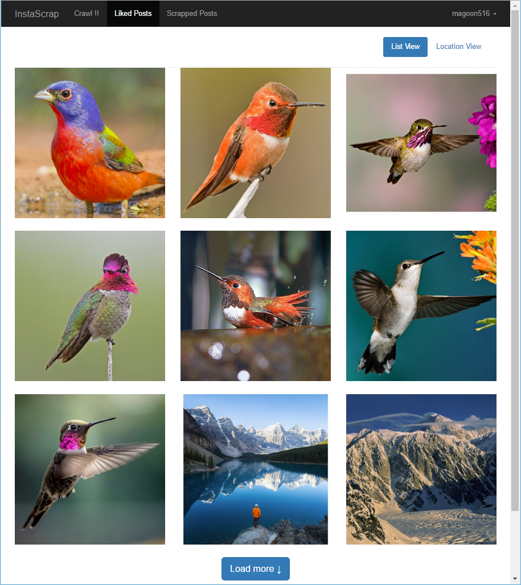
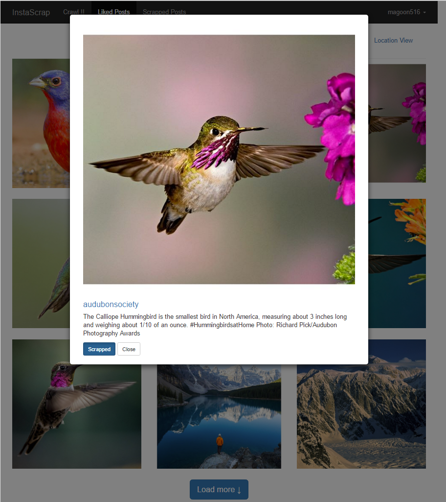

# InstaScrap
A django application to scrap posts from Instagram posts you liked.

### Installation
* Install python3 and create an pyvenv directory.
* Fill your deploy info in `deploy_info.json`.
* Browse into deploy_tools, enable pyvenv, and run `python deploy.py`.

### Dependency
* Developed using python 3.4.3
* Deployed on Ubuntu 14.04 on Amazon EC2 using nginx and uwsgi.
* Python package dependency: see deploy_tools/pip_freeze/deploy_env_ubuntu.txt.

### Screenshots
]

